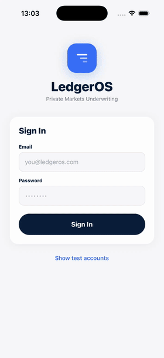
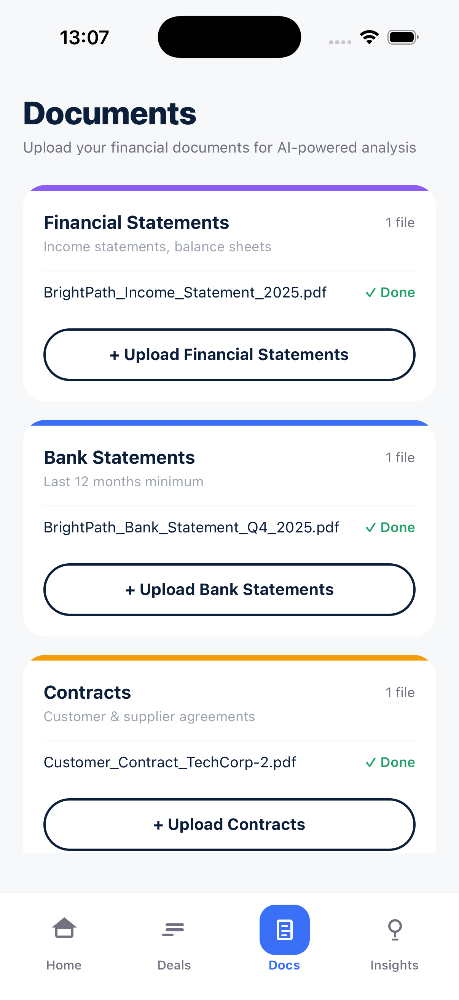
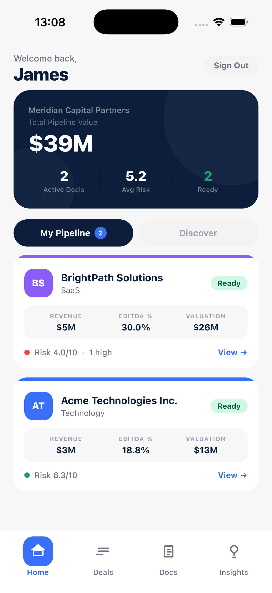

# Private Markets Underwriting Infrastructure

A full-stack platform that dramatically reduces the time and cost of underwriting SME deals. SMEs upload their financial documents; the system returns a normalized analysis, fraud signals, and an investment memo. Investors get a risk score, downside scenarios and a dynamic valuation model. 

  

---

## Features

### For SMEs
- **Document Upload** — financials, bank statements, contracts, tax docs
- **Financial Normalization** — auto-structured P&L, balance sheet, and cash flow
- **Fraud Signal Detection** — flags anomalies across statements and declared figures
- **Cash Flow Forecasting** — ML-driven 12–24 month projections
- **Investment Memo Generation** — structured memo ready for investor review

### For Investors
- **Risk Score** — composite score with weighted factor breakdown
- **Downside Scenarios** — stress-tested bear/base/bull case modeling
- **Comparable Businesses** — benchmarked against similar deals and public proxies
- **Dynamic Valuation Model** — adjustable assumptions with real-time output

---

## Tech Stack

| Layer | Technology |
|---|---|
| Mobile App | React Native + Expo |
| Backend API | Node.js + Express |
| Document Processing | OCR + LLM extraction pipeline |
| Database | PostgreSQL |
| File Storage | S3-compatible object storage |
| Auth | JWT + refresh token rotation |

---
## Screenshots

| SME Upload Flow | Risk Dashboard | Financial Analysis | Business Insights |
|---|---|---|
|  |  | ) |) |

---
